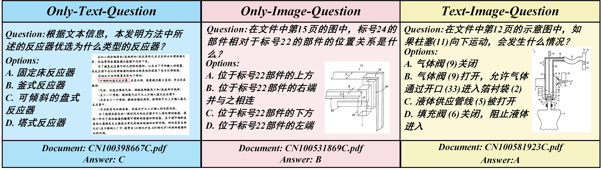

# ITMQ

本仓库包含论文**中文工业技术文档多模态推理问答数据集**的数据集。

我们发布了关于该数据集的测评任务：[CCKS2025-工业技术文档多模态推理问答评测](https://tianchi.aliyun.com/competition/entrance/532357)。比赛依托于阿里天池平台，用户可以参与比赛对模型进行测试。

## 数据集介绍

ITMQ:一个专为工业制造领域的多模态理解与推理任务设计的数据集。该数据集涵盖了大量源自工业技术文档和装备制造相关专利的中文问题，具有高度专业性与真实性。ITMQ共包含10,096个精心挑选的多模态问题，问题类型主要分为三类，如图1所示：纯文本问题、纯图像问题，以及文本-图像混合问题，全面覆盖了工业生产过程中常见的多种复杂情况。此外，ITMQ还具有两个领域数据特征：首先，ITMQ并不直接提供可编辑的文本信息或标准图像数据，而是以不可编辑的图片型PDF文档形式呈现。这些文档通常分辨率较低、格式不一、内容复杂，对模型的感知与解析能力提出了更高要求。其次，数据集中包含大量交错的文本-图像类型问题。模型在回答此类问题时，需同时理解文本描述和技术图纸，并通过模块功能分析或机械原理推理完成问题解答，这对模型的多模态融合与推理能力构成严峻考验。

## 说明

为保证测评任务的公平性，目前本仓库仅公开部分数据，测评任务结束后会将全部数据集与相关的测评结果公开。
